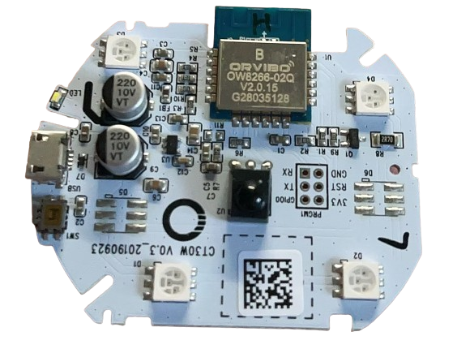
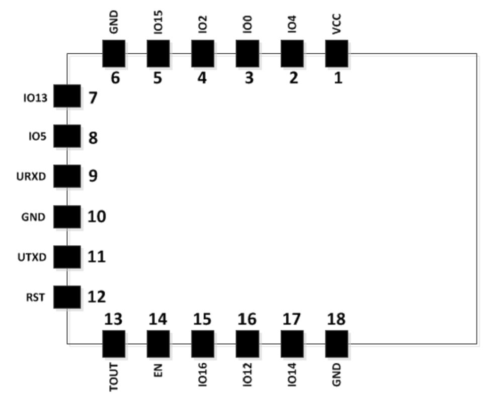

# ORVIBO-CT30W

欧瑞博 CT30W 智能红外遥控器主板焊有一片 OW8266-02Q、一颗白色 LED、一颗红外接收头（未被使用）、四颗红外发射头。支持通过 2.4G WiFi 和家亲 APP 连接，目前售价 10 元左右。

官方固件默认波特率：74880

## 引脚定义

| 功能名称     | GPIO 引脚 |
|-------------|-----------|
| 板载按钮     | GPIO4     |
| 板载白色 LED | GPIO15    |
| 红外接收     | GPIO5     |
| 红外发送     | GPIO14    |

## ESPHOME
ESPHOME board should be esp_wroom_02(only 2MByte spi flash)

OW8266-02Q 与 WT8266-S1 非常相似，资料可从此获得：[WT8266-S1 WiFi Module Based on ESP8266](https://core-electronics.com.au/wt8266-s1-wifi-module-based-on-esp8266.html)。

## 烧录自定义固件

前提条件：

1. CH341 等 USB 转 TTL 工具
2. 五根杜邦线、排针
3. 电烙铁

主板测试点间距 2.0mm，可以买 2.0 排针焊接上去，也可以用 2.54 排针掰一下焊接上去。

以下测试点通过杜邦线分别连接到 CH341 引脚上：

| CT30W       | CH341     |
|-------------|-----------|
| 3V3         | VCC       |
| GND         | GND       |
| RST         | 不接      |
| GPIO0       | GND       |
| RX          | TX        |
| TX          | RX        |

将 CH341 连接电脑，此时 OW8266 模块为下载模式，可以通过 Arduino 或是其他烧录工具直接下载固件到模块。下载完后拔掉 GPIO0 重新上电即为正常启动模式。

可以使用在线烧录 ESP 固件工具（需要使用 Chromium 系浏览器）：https://esp.huhn.me/

## 固件

 - ow8266 文件夹为 Arduino 发送接收红外示例，可以使用 Arduino 工具直接下载；
 - https://github.com/Mixiaoxiao/ESP8266-IR-HOMEKIT

### 默认启动信息：
  ets Jan  8 2013,rst cause:2, boot mode:(3,6)
  
  load 0x40100000, len 1416, room 16 
  tail 8
  chksum 0x0d
  load 0x3ffe8000, len 764, room 0 
  tail 12
  chksum 0x6c
  ho 0 tail 12 room 4
  load 0x3ffe82fc, len 764, room 12 
  tail 0
  chksum 0x6b
  csum 0x6b
  
  2nd boot version : 1.4(b1)
  [D]: magic e9
  [D]: blocks 03
  [D]: spi_mode 00
  [D]: spi_speed 00
  [D]: spi_size_map 05
    SPI Speed      : 40MHz
    SPI Mode       : QIO
    SPI Flash Size & Map: 16Mbit(1024KB+1024KB)
  @0x1000 : 500304EA 40100004 00000000 00080080
  u_param.ready_flag 255,u_param.move_flag 255,bin_len:4294967295
  flash init status
  jump to run user1 @ 1000
  
  
  
  [2025-07-05 17:12:22.446]# RECV ASCII>
  OS SDK ver: 2.0.0(30727a0) compiled @ Jan  3 2019 14:43:04
  phy ver: 1055_8, pp ver: 10.7
  
  rf cal sector: 507
  
  
  
  
  ID : b6646e46ed994627bd0cc0c1a34fd951
  SwVer : v2.0.15
  
  #MAC#C8C9A30B0009
  
  
  
  System Power On
  WIFI start
  
  mode : sta(c8:c9:a3:0b:00:09) + softAP(ca:c9:a3:0b:00:09)
  add if0
  dhcp server start:(ip:192.168.188.1,mask:255.255.255.0,gw:192.168.188.1)
  add if1
  bcn 100
